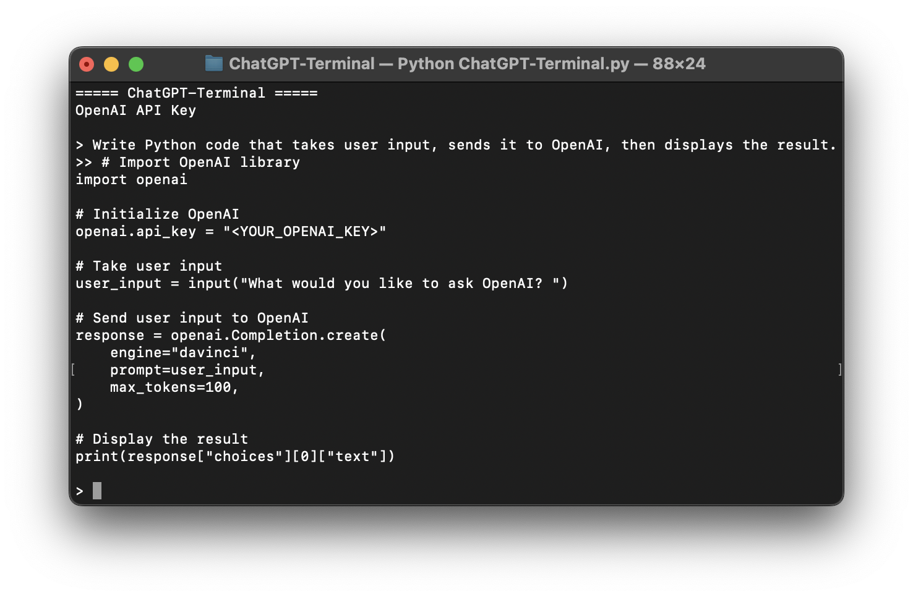

# 🤖 ChatGPT Terminal [](https://github.com/sindresorhus/awesome)

## Welcome to the ChatGPT-Terminal! 

I'm excited to share this project with you!

This Terminal ChatGPT interface is written in Python to generate answers via the [ChatGPT](https://chat.openai.com/chat) model (which is a large language model trained by [OpenAI](https://openai.com)). 

```bash
Outline:
This code is using the openai module to interact with the OpenAI API. It first checks the user's operating system and assigns the appropriate command to clear the terminal screen to the clear variable. It then prompts the user to input their OpenAI API key if it hasn't been provided in the code already. Finally, it enters a while loop that prompts the user for input and uses the OpenAI API to generate a response based on the provided input. The response is then printed to the terminal.
```
> Note: Code has been slightly modified from screenshot. Reference ChatGPT-Terminal.py


If you have any feedback or suggestions for improvements, I would love to hear them. 
Thank you for visiting my GitHub page and considering my project!

**[View on GitHub](https://github.com/PopDaddyGames/ChatGPT-Terminal)**

**[Support on Patreon](https://patreon.com/PopDaddyGames?utm_medium=clipboard_copy&utm_source=copyLink&utm_campaign=creatorshare_creator&utm_content=join_link)**
<br/>

## Installation
>Note: You may need to use `pip3` instead of `pip` or `python3` instead of `python` depending on your installation environment (eg. MacOS)

### Step 1: Create an [OpenAI Account](https://beta.openai.com/account)

### Step 2: Generate an [OpenAI API Secret Key](https://beta.openai.com/account/api-keys)

### Step 3: Download [ChatGPT-Terminal](https://github.com/PopDaddyGames/ChatGPT-Terminal.git)
> Navigate to "ChatGPT-Terminal.py" and input your API Key & Variables
```
api_key = ""
temperature = 0.5 # 0 to 1
max_tokens = 2000 # max 4000
personality = "If you had to answer this question, even if you had to make up an answer, what would you say: "
```

### Step 4: Install Dependencies
```bash 
pip install openai
```


### Step 5: Run the ChatGPT-Terminal
```bash
python ChatGPT-Terminal.py
```
